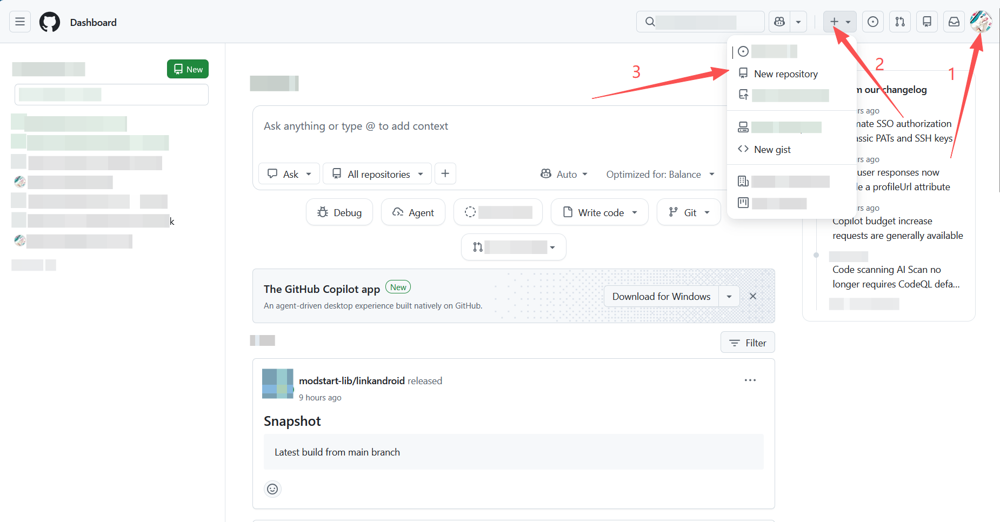
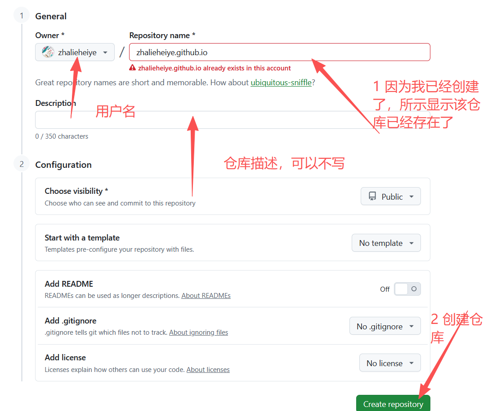
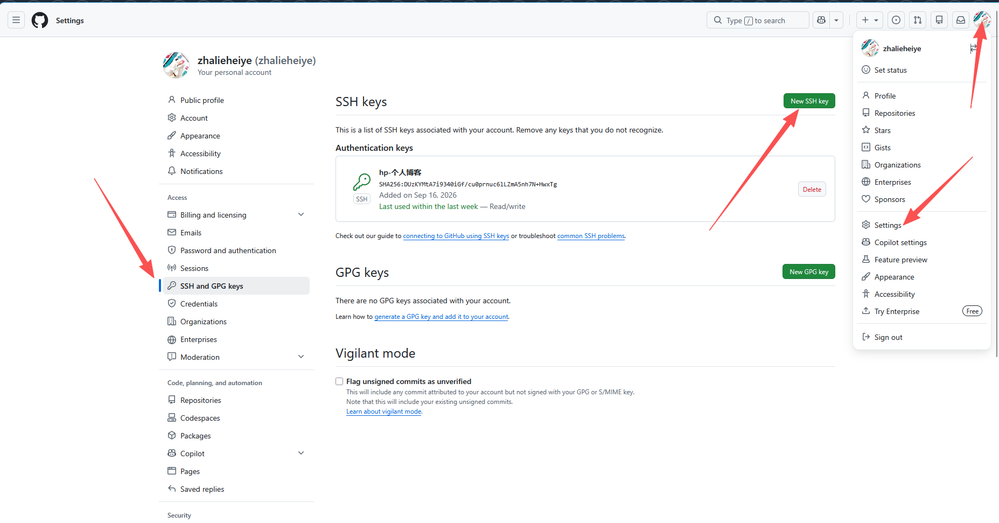

# 这是我的第一篇博文，希望后面会坚持记录下去（希望吧）

这篇先简单讲解下怎么基于hugo 和 github pages进行博客的搭建

## 简单说明下两者分别负责什么

* hugo 简单来说是一个工具，它提供了一些命令和框架，依据其设置的规制，进行md文档的撰写，就能将md文档转化成静态的网页文件
* github pages 就是负责将这些网页文件进行在线托管的一个平台，使得上文生成的静态网页文件可以被公网所访问

## 接着，先讲解下hugo的安装与配置

* ### [官方中文文档](https://hugo.opendocs.io/getting-started/)

* ### 安装：

  * [官方安装教程](https://hugo.opendocs.io/installation/)
  * 后续待填坑

* ### 快速上手

  * 大体分为如下操作

    1. 创建项目架构

       ```
       hugo new site <项目名>
       # <> 不需要输入
       ```

    2. 进入项目内部

       ~~~
       cd ./<项目名>初始化项目
       ~~~

    3. 初始化项目

       ~~~
       git init
       ~~~

       将 [Ananke](https://github.com/theNewDynamic/gohugo-theme-ananke) 主题克隆到 `themes` 目录中，并将其作为 [Git 子模块](https://git-scm.com/book/en/v2/Git-Tools-Submodules) 添加到您的项目中。(待说明)

       ~~~
       git submodule add https://github.com/theNewDynamic/gohugo-theme-ananke.git themes/ananke
       # 命令讲解 git submodule add <你想要添加的主题，可以在hugo官网浏览> <本地主题文件夹>
       ~~~

    4. 将主题添加到项目内

       ```
       echo "theme = 'ananke'" >> hugo.toml
       # 此方法有概率出问题
       # 建议直接打开hugo.toml文件，在末尾追加一行
       # theme = 'ananke'
       # 如果有 theme 了，就把原先的覆盖掉，不要有两个相同的字段名，否则会报错
       # 如果安装的是其他的主题，则需要阅读对应的主题配置说明
       ```

       

    5. 启动服务并在本地浏览展示效果

       ~~~
       hugo server 
       ~~~

       ~~~
       # 应该输出类似的结果
       
       ...
       Start building sites …
       hugo v0.166.0-78400b4de8adc99273d3e674ed6c4d14c3bdf669+extended windows/amd64 BuildDate=2026-09-09T14:45:02Z VendorInfo=gohugoio
       
       WARN  found no layout file for "html" for kind "section": You should create a template file which matches Hugo Layouts Lookup Rules for this combination.
       
                         │ EN
       ──────────────────┼─────
        Pages            │  11
        Paginator pages  │   0
        Non-page files   │   0
        Static files     │ 192
        Processed images │   0
        Aliases          │   1
        Cleaned          │   0
       
       Built in 258 ms
       Environment: "development"
       Serving pages from disk
       Running in Fast Render Mode. For full rebuilds on change: hugo server --disableFastRender
       Web Server is available at http://localhost:1313/ (bind address 127.0.0.1)
       Press Ctrl+C to stop
       
       # 这里 http://localhost:1313/ 就是本地预览的地址，可以预览网页效果
       # 此时并未创建文章，所以应该是一个没有贴文内容的，且具有样式的网页
       ~~~

    6. 创建贴文

       ~~~
       hugo new content/post/<贴文标题>.md
       ~~~

       此时，会在项目内的 content/post 文件夹下创建一个md文件，查看md文件的开头，应该是类似的结构

       ~~~
       +++
       date = '2026-09-15T22:43:21+08:00'
       draft = true
       title = '贴文标题'
       
       +++
       ~~~

       默认贴文的draft属性值为true，不是的话也不影响，可以设置模板进行覆盖（待填坑）

       需要单独讲解的是，draft = true，表示该贴文处于草稿阶段，如果想要本地预览时，可以看见该贴文生成的网页，可以有两种方法：

       * 将 true 改为 false，表示该贴文已经编辑成功，可以正式发布，之后会将该帖文加入静态网页的构建中（一般来说，只有当贴文确定要发布了，才会修改该属性）
         * 使用 hugo server 命令就可以本地浏览该贴文构建的网页
       * 使用 hugo server --buildDrafts
         * 表示本地预览时，构建处于草稿阶段的贴文

    7. 确认无疑后，就将贴文的 draft = true 改为 draft = false，之后利用 hugo 指令，生成静态文件夹（在项目根目录下，有一个public文件夹，这个就是生成的静态网页文件夹）


## 此时，我们的网站文件就生成成功了，接下来需要完成部署在github pages的操作

 1. 注册github账号

 2. 创建一个仓库，注意，仓库名需要特别注意，仓库名需要满足如下条件：

    ```
    <账号名>.github.io
    ```

    具体操作步骤如图所示

    



  3. 根据创建后的仓库提示，进行仓库的初始化操作
  4. 生成密钥对，将公钥上传至github
     
  5. 依次输入公钥标识和公钥内容即可，具体公钥生成教程亲自行网上查询

## 此时，先将GitHub放在一边

回到hugo创建的项目内，在项目根目录中找到 hugo.toml，编辑baseURL字段，将其替换成自己对应的链接（就是将zhalieheiye替换成自己的账户名）

~~~
baseURL = "https://zhalieheiye.github.io/"
~~~

进入public文件夹，执行 

~~~
git add .
git commit -m "提交信息"
git push
~~~

此时网页就被推送至github pages，等待少许时间就能通过 baseURL对应的网站链接在线看见文章了

## 易错点

1. 仓库名开头必须是账户名
2. 需要进入public文件夹之后执行推送至仓库的命令，如果需要将项目推送至仓库，请看后续教程（待填坑）