# 开启虚拟化

打开 控制中心，点击 程序。

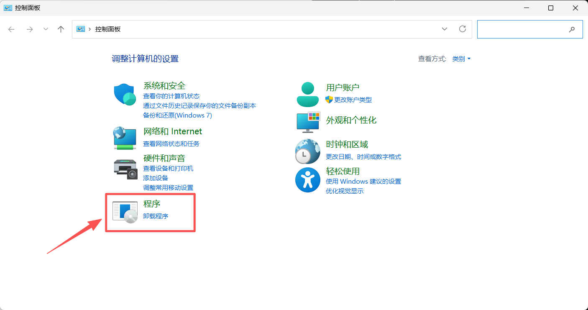

点击 启用或关闭Windows功能

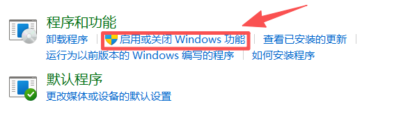

确保开启红框标注的功能，根据系统提示进行操作，重启电脑

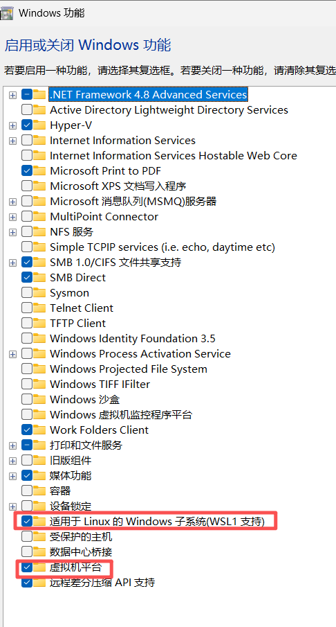

# 安装wsl2

点击[此处](https://github.com/microsoft/WSL/releases)，跳转到微软的wsl仓库，选择合适的版本。

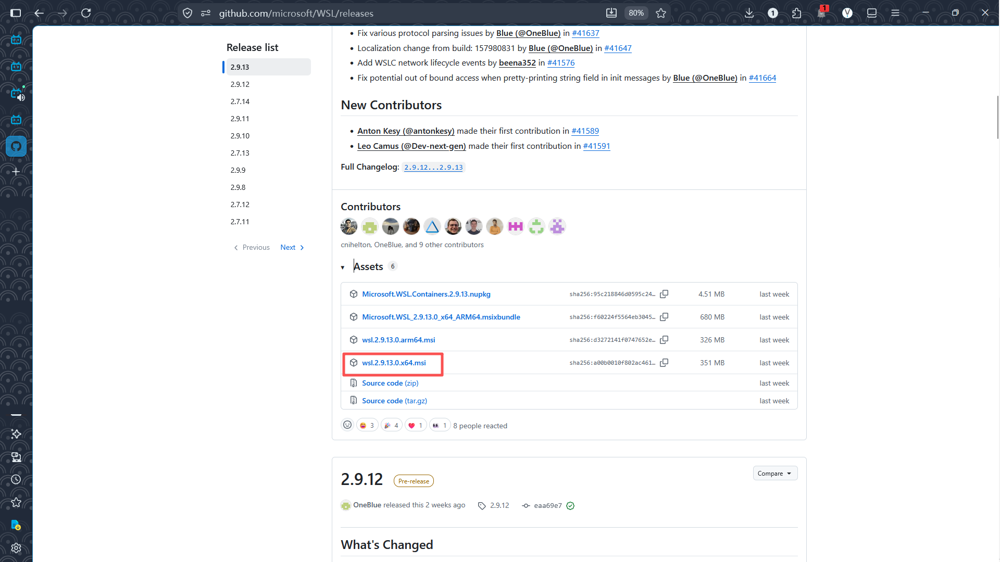

双击下载后的文件，根据系统提示操作

# 下载ubuntu的wsl镜像文件

点击[此处](https://ubuntu.com/download/wsl)，跳转至最新版的下载界面

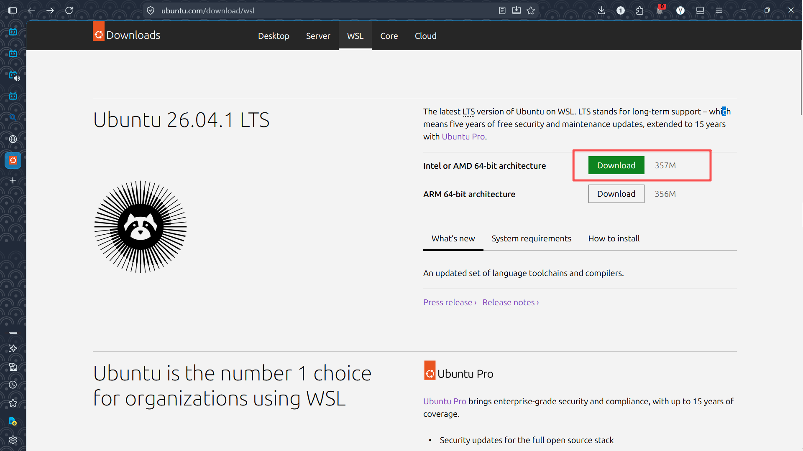

如果需要历史版本，点击[此处](https://ubuntu.com/download#download)跳转

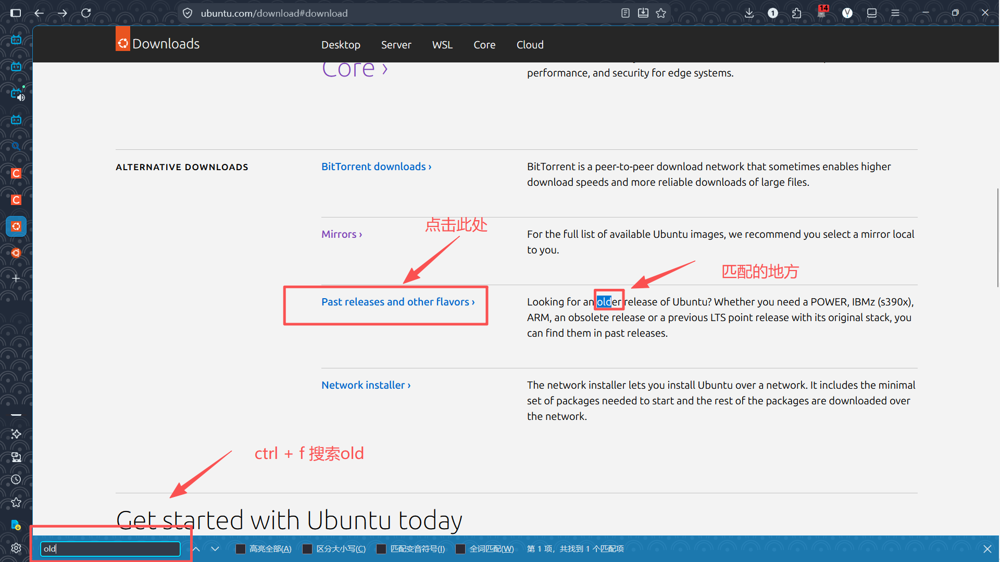

这些就是历史版本，点击即可跳转至对应界面

需要注意的是，有些版本没有wsl版

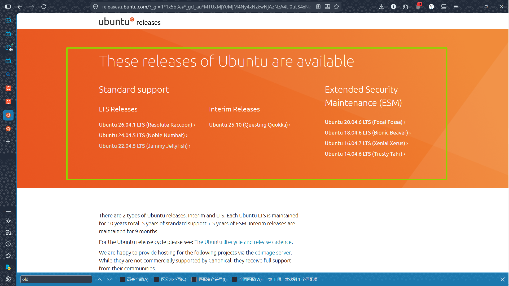

以版本22.04为例，找到WSL image，点击 64-bit 这个链接，即可自动下载对应的wsl文件

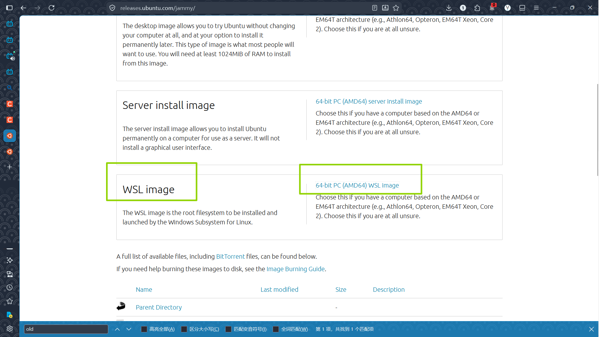

如果合适的话，wsl文件图标应该是个小企鹅

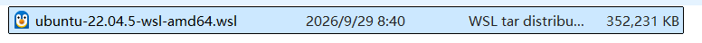

# 安装wsl

打开cmd，依次输入这些命令，如果有类似结果，就说明可以安装了

```
wsl --update
```

```
wsl --version
```

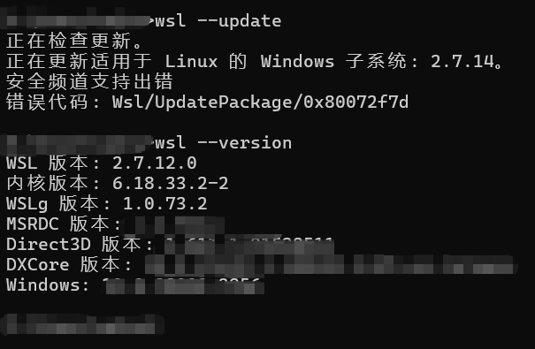

wsl默认的安装路径在c盘，可以用--location来指定安装路径

```
wsl --install --from-file <wsl文件路径> --location <更改的安装路径> --name <虚拟机命名，可选>
```

具体操作如如所示，后续步骤为创建用户和设置root用户密码

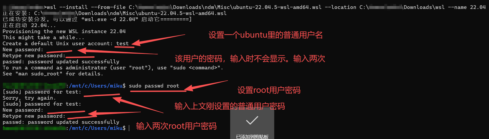

# 删除已安装的子系统

使用如下命令展示当前已经安装的子系统

```
wsl --list
```

卸载子系统

```
wsl --unregister <子系统名>
```

具体操作如图所示。当前使用的不是cmd，故界面有些不同。cmd输入相同命令即可

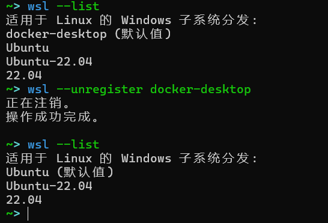

# 进入子系统

上图安装的截图其实已经告知了如何进入子系统

```
wsl -d <子系统名称>
```

# 完结

至此，wsl里的ubuntu子系统就已经安装完，目前可以进行初步的使用
